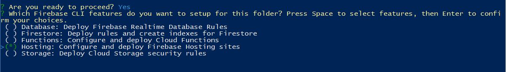

# Steps to deploy an angular application with firebase hosting.

1. Create a google account.

2. Go to the [firebase console](https://console.firebase.google.com).

3. In the firebase console, create a new project.

    
    
    
    
    - Remember the id of the project.
    
    - Specify your region and validate.

5. Install [Nodejs](https://nodejs.org/en/download/)

6. Install angular-cli and firebase-tools.

    ```
    npm install -g @angular/cli firebase-tools
    ```

7. Create a new angular project.
    ```
    ng new angular-firebase
    ```

8. Build your application.

In your angular folder, build the application.

    ```
    ng build --aot
    ```

It will create a `dist` folder with your code *(The folder can be hidden by .gitignore)*.

9. Log in to firebase
    ```
    firebase login
    ```

10. Initialize your project
    ```
    firebase init
    ```

    

    

    - Select hosting in the choice.
    
    - Select your project or 'don't setup a default project'
    
    

    - To the question 'What do you want to use as your public directory ?', give the path to your `dist/<angular-project-name>` folder.
    
    - To the question 'Configure as a single-page app (rewrite all urls to /index.html)?', answer 'Yes'.
    
    - To the question 'File angular-firebase/dist/index.html already exists. Overwrite?', answer 'No'.

11. (Optional) default project configuration.

    If you answer 'don't setup a default project', in the file `.firebaserc` copy the following code with the id of the project :
    
    ```
    {
      "projects": {
        "default": <PROJECT_ID>
      }
    }
    ```

12. Deploy to firebase
    ```
    firebase deploy
    ```
    
    The link to the application can be found directly in the terminal or in the firebase console in the hosting menu.

    

    
